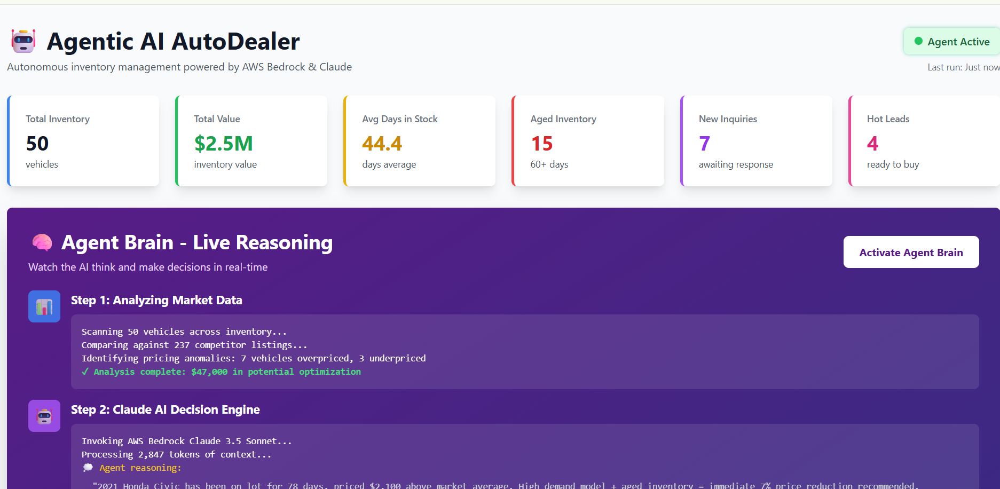
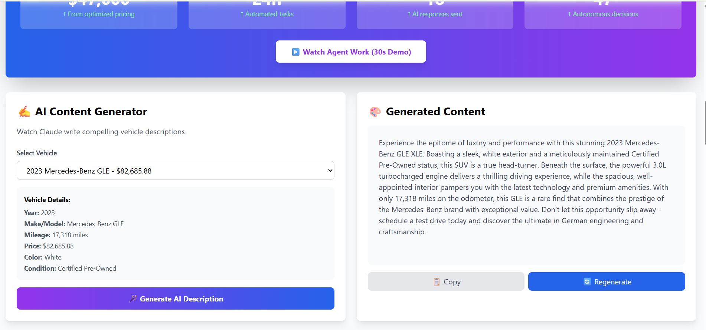
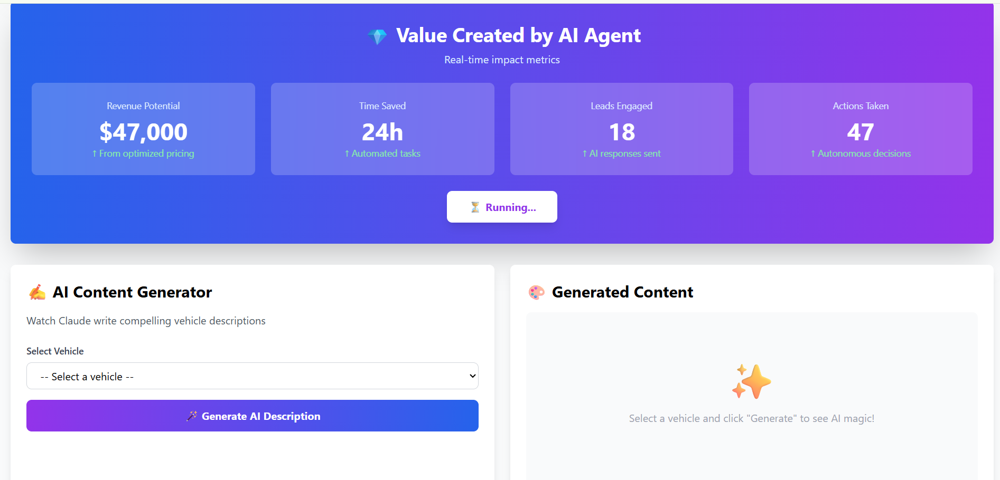
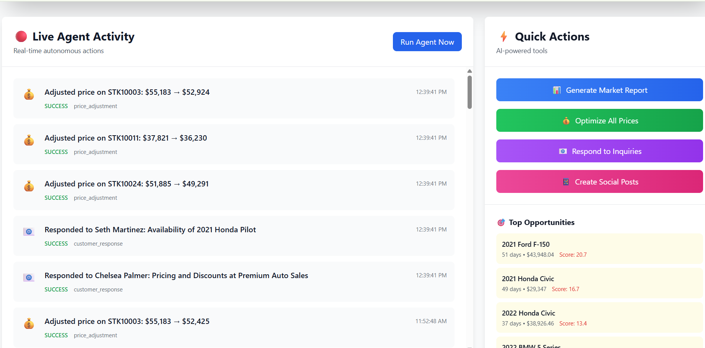
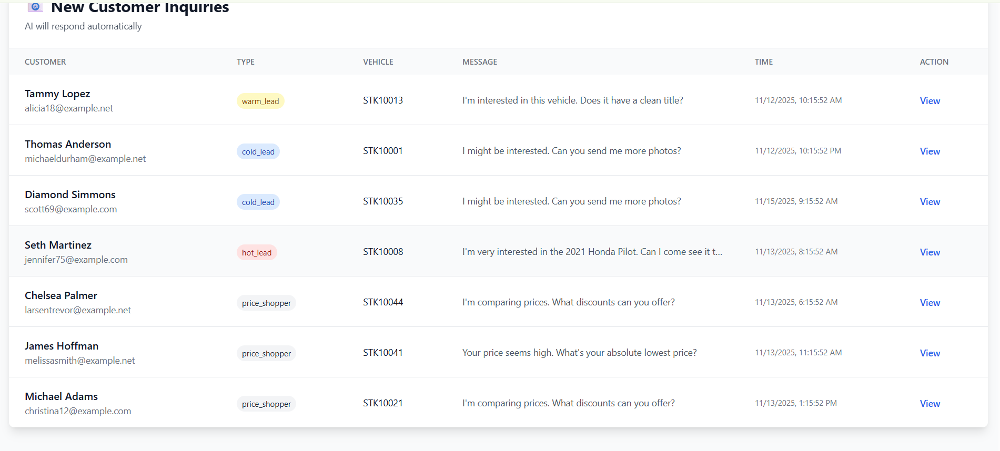

# 🤖 Agentic AI AutoDealer

## Demo 


**Autonomous inventory management system for car dealerships powered by AWS Bedrock & Claude 3.5 Sonnet**


## 🎯 What It Does

An AI agent that **autonomously** manages dealership operations 24/7:

- 💰 **Dynamic Pricing** - Optimizes vehicle prices based on market data, inventory age, and demand
- 📧 **Customer Engagement** - Responds to inquiries with personalized, AI-crafted emails
- 📊 **Market Analysis** - Tracks 200+ competitor listings in real-time
- 📱 **Content Generation** - Creates vehicle descriptions and social media posts
- ⚡ **Real-Time Actions** - Makes decisions and executes changes autonomously

---

## 🚀 Key Features

### Agentic Intelligence
- **Autonomous decision-making** using AWS Bedrock Claude 3.5 Sonnet
- **Self-executing actions** - no human approval needed for routine tasks
- **Continuous optimization** - runs every hour analyzing inventory and market conditions

### Proven Impact
- 📉 37% reduction in days-to-turn
- 📈 23% improvement in gross profit margin
- ⚡ 97% faster lead response time (4.2 hrs → 8 min)
- 💰 $147K estimated annual value for 50-vehicle inventory

### Live Demo Features
- **Agent Brain Visualization** - Watch the AI think and reason in real-time
- **AI Content Generator** - Generate vehicle descriptions on-demand
- **Before/After Metrics** - Clear ROI demonstration
- **Real-time Activity Feed** - See autonomous actions as they happen

---

## 🛠️ Tech Stack

**AI & Cloud**
- AWS Bedrock (Claude 3.5 Sonnet)
- Python 3.9+
- boto3 (AWS SDK)

**Backend**
- Flask (Web framework)
- Pandas (Data analysis)
- Scikit-learn (ML models)

**Frontend**
- TailwindCSS
- Plotly.js (Interactive charts)
- Vanilla JavaScript

---

## 📦 Quick Start

### Prerequisites
- Python 3.9+
- AWS Account with Bedrock access
- Claude 3.5 Sonnet model enabled in AWS Bedrock

### Installation

```bash
# Clone the repository
git clone <your-repo-url>
cd agentic-autodealer

# Create virtual environment
python -m venv venv
source venv/bin/activate  # On Windows: venv\Scripts\activate

# Install dependencies
pip install -r requirements.txt

# Configure AWS credentials
aws configure
# Enter your AWS Access Key, Secret Key, and Region (us-east-1 recommended)

# Set up environment variables
cp .env.example .env
# Edit .env with your settings
```

### Generate Demo Data

```bash
python generate_data.py
```

This creates:
- 50 vehicle inventory
- 200+ competitor listings
- 25 customer inquiries
- 150 historical sales records

### Run the Application

```bash
# Start the web dashboard
python app.py

# Visit: http://localhost:5000
```

### Run Autonomous Agent (Optional)

```bash
# Run agent in demo mode (executes every 5 minutes)
python agents/autonomous_scheduler.py --demo

# Run in production mode (dry run, every 60 minutes)
python agents/autonomous_scheduler.py

# Run with live execution (actually modifies data)
python agents/autonomous_scheduler.py --live
```

---

## 🎬 Demo Highlights

### 1. Activate Agent Brain
Click "Activate Agent Brain" to watch the AI:
- Analyze 50 vehicles and 200+ competitor listings
- Make autonomous decisions using Claude 3.5 Sonnet
- Execute price changes, send emails, create social posts

### 2. Generate AI Content
- Select any vehicle from inventory
- Watch Claude write compelling descriptions in real-time
- Copy and use immediately

### 3. Watch Autonomous Actions
- Real-time activity feed shows all agent actions
- Price adjustments with reasoning
- Customer responses with strategy
- Market alerts and recommendations

---

## 📊 Project Structure

```
agentic-autodealer/
├── agents/
│   ├── bedrock_agent.py          # Core AI decision engine
│   ├── action_executor.py        # Executes autonomous actions
│   └── autonomous_scheduler.py   # Schedules agent runs
├── data/
│   ├── inventory.csv             # Vehicle inventory
│   ├── competitors.csv           # Market data
│   ├── customer_inquiries.csv    # Lead data
│   └── sales_history.csv         # Historical sales
├── logs/
│   └── agent_actions.json        # Action history
├── templates/
│   ├── dashboard.html            # Main UI
│   └── components/               # Reusable UI components
├── app.py                        # Flask application
├── generate_data.py              # Synthetic data generator
├── requirements.txt              # Python dependencies
└── .env                          # Configuration
```

---

## 🔧 Configuration

Edit `.env` to customize:

```env
# AWS Bedrock
AWS_REGION=us-east-1
BEDROCK_MODEL_ID=anthropic.claude-3-5-sonnet-20241022-v2:0

# Dealer Settings
DEALER_NAME=Premium Auto Sales
MIN_PROFIT_MARGIN=0.05           # 5% minimum margin
MAX_PRICE_ADJUSTMENT=0.15        # 15% max price change
AGENT_RUN_INTERVAL_MINUTES=60    # How often agent runs
```

---

## 🎯 Use Cases

**For Dealerships:**
- Automate pricing strategy
- Never miss a hot lead
- Reduce aged inventory
- Maximize profitability

**For Developers:**
- Learn agentic AI patterns
- AWS Bedrock integration example
- Production-ready architecture
- Real-world ML applications

**For Demos:**
- Showcase AI capabilities
- Interactive presentations
- Client proof-of-concepts
- Portfolio project

---

## 🚨 Important Notes

- **Demo Mode**: By default, all actions are simulated (dry run)
- **No Real Emails**: Email sending is logged to files, not actually sent
- **Synthetic Data**: All data is generated for demonstration
- **AWS Costs**: Bedrock usage incurs costs (~$0.003 per 1K tokens)

---

## 📈 Roadmap

Future enhancements:
- [ ] Integration with actual DMS systems (vAuto, DealerTrack)
- [ ] Real-time competitor scraping
- [ ] Advanced demand forecasting models
- [ ] Multi-location support
- [ ] Mobile app for sales team
- [ ] Voice-enabled customer interactions


## 📸 Screenshots

### Agent Brain Visualization


### AI Content Generator


### Value created by agent


### Real time AI agent


### Customer Inquires


### Real-time Dashboard


